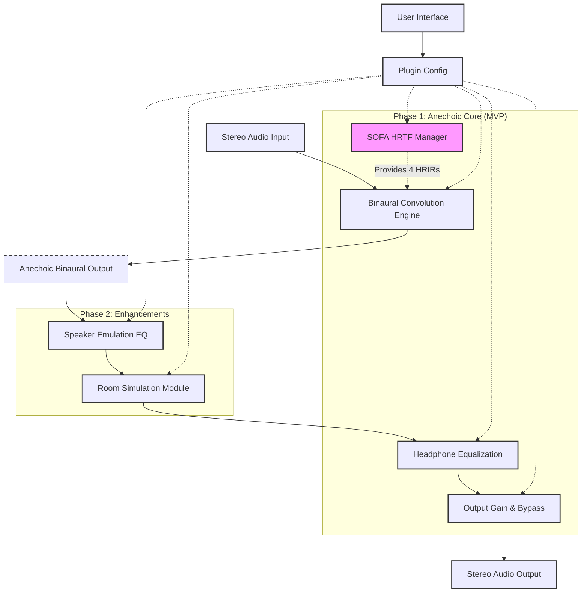

# Open Headstage

Open Headstage is an open-source binaural speaker simulation plugin for headphones, designed for Linux-based audio professionals and enthusiasts.
The goal is to provide a high-quality, flexible tool for experiencing stereo audio as if listening to physical speakers in a well-defined acoustic space.

## Current Phase
Phase 1: Anechoic Core Development (Project Initialization)

## Core Features (MVP - Phase 1)
- Binaural Convolution Engine (4-path for anechoic HRTFs)
- Direct SOFA HRTF/BRIR file loading (`.sofa`)
- Speaker angle selection (manual and presets)
- Headphone Parametric Equalization (10-band PEQ with AutoEq import)
- CLAP plugin format for Linux (with potential VST3 support in the future).

## Tech Stack (Planned)
- Language: Rust
- Plugin Framework: `nih-plug`
- SOFA Library: `libmysofa` (via FFI)
- FFT Library: `RustFFT` (or similar)
- Resampling: `rubato` (or similar)

## Bloc Diagram

## Building from Source
(This section will detail the steps to compile the project, including installing Rust, any system dependencies (like `libmysofa` development files), and running `cargo build`.)

## How to Contribute
(This section will outline the process for contributing, such as forking the repository, creating a new branch, submitting pull requests, and linking to the issue templates.)

## Roadmap

Our primary focus is on delivering a robust CLAP plugin for Linux. Future development may include VST3 support after CLAP implementation is mature.

*(Note on current development status: While the logical design of core features like DSP modules, SOFA loading, and plugin structure is progressing, full compilation and testing of the `nih-plug` based plugin is currently blocked by persistent procedural macro expansion issues in the development environment. The roadmap reflects the intended implementation order once these environmental challenges are resolved.)*

**Phase 1: Anechoic Core CLAP Plugin (MVP - In Progress)**

This phase focuses on creating a functional CLAP plugin with anechoic binaural processing, SOFA loading, and headphone EQ.

*   **1.1: Core DSP - FFT-Based Convolution Engine (`src/dsp/convolution.rs`)**
    *   Implement a 4-path convolution engine (LSL, LSR, RSL, RSR).
    *   Utilize `RustFFT` for FFT operations (Overlap-Add or Overlap-Save method).
    *   Provide methods to set individual HRIR paths (`set_ir`).
    *   Process stereo audio blocks (`process_block`).
    *   Comprehensive unit tests for various IR types (identity, delay, simple filters) and state management.
    *   *Status: FFT-based engine structure implemented and conceptually tested.*

*   **1.2: SOFA HRTF Integration (`src/sofa/loader.rs`)**
    *   Develop FFI bindings for `libmysofa` (e.g., via `rust-bindgen`).
    *   Create a safe Rust wrapper (`MySofa`) for `libmysofa` to handle:
        *   Opening SOFA files (`mysofa_open`), including resampling to plugin's sample rate.
        *   Retrieving HRIR pairs for specified azimuth/elevation/radius (`mysofa_getfilter_float`).
        *   Coordinate system conversions (`mysofa_s2c`, `mysofa_c2s`).
    *   Manage `libmysofa` resources correctly (e.g., `mysofa_close` via `Drop` trait).
    *   *Status: FFI bindings and `MySofa` wrapper structure implemented. `mysofa_open` and `get_hrtf_irs` are defined. Critical TODO remains for robust error handling in `get_hrtf_irs` due to FFI binding challenges.*

*   **1.3: `nih-plug` Framework & Core Plugin Structure (`src/lib.rs`)**
    *   Set up `nih-plug` for CLAP export (`nih_export_clap!`).
    *   Define main plugin struct (`OpenHeadstagePlugin`) and parameters struct (`OpenHeadstageParams`).
    *   Implement `Plugin` trait with placeholders for core methods (`initialize`, `reset`, `process`, `editor`).
    *   Define initial parameters in `OpenHeadstageParams`:
        *   Output Gain (`FloatParam`).
        *   L/R Speaker Azimuth & Elevation (`FloatParam`s).
        *   SOFA file path (`StringParam`, persisted).
    *   *Status: Intended structure defined. Blocked by persistent `nih-plug` macro compilation errors (E0277 `ClapPlugin` trait not satisfied) in the current build environment. This prevents functional parameter definition and plugin export testing.*

*   **1.4: Integration of Modules into Plugin Logic (`src/lib.rs`)**
    *   Instantiate `ConvolutionEngine` and `MySofa` (optional) within `OpenHeadstagePlugin`.
    *   `Plugin::initialize()`:
        *   Store sample rate.
        *   Load SOFA file specified by `sofa_file_path` parameter using `MySofa::open`.
        *   On success, call helper `update_hrirs()` to load initial HRIRs into `ConvolutionEngine`.
    *   `Plugin::process()`:
        *   If SOFA is loaded, check for speaker angle parameter changes. If changed, call `update_hrirs()`.
        *   Process audio block through `ConvolutionEngine`.
        *   Apply output gain.
    *   `update_hrirs()` helper: Retrieves LSL, LSR, RSL, RSR IRs from `MySofa` based on current angle parameters and updates the `ConvolutionEngine`.
    *   *Status: Logical integration designed. Blocked by `nih-plug` compilation issues preventing full implementation and testing.*

*   **1.5: Headphone Parametric Equalization (`src/dsp/parametric_eq.rs`, `src/autoeq_parser.rs`)**
    *   Implement `BiquadFilter` (Peak, LowShelf, HighShelf) with coefficient calculation (Audio EQ Cookbook) and stateful processing.
    *   Implement `StereoParametricEQ` to manage a bank of (e.g., 10) stereo biquad filters.
    *   Develop `AutoEqParser` to read AutoEQ headphone correction text files.
    *   Define parameters in `OpenHeadstageParams` for EQ enable and 10 bands of EQ settings (persisted).
    *   Conceptually integrate `StereoParametricEQ` into `Plugin::process()` (after convolution).
    *   *Status: `BiquadFilter`, `StereoParametricEQ`, and `AutoEqParser` DSP/logic implemented and unit-tested. Plugin integration blocked by `nih-plug` issues.*

*   **1.6: Basic User Interface (`egui`) (`src/lib.rs`)**
    *   Implement `Plugin::editor()` using `nih-plug-egui`.
    *   Design UI layout for:
        *   Button to load SOFA file (using `rfd` for dialog), displaying current path.
        *   Sliders for output gain.
        *   Sliders for L/R speaker azimuth/elevation.
        *   Checkbox to enable/disable EQ.
        *   Controls for 10 EQ bands (enable, type, Fc, Q, Gain).
        *   (Stretch goal: 2D pad for speaker angle selection).
    *   *Status: Conceptual UI layout defined. Blocked by `nih-plug-egui` dependency issues and underlying `nih-plug` macro compilation errors.*

*   **1.7: Build, Test, and Refine MVP**
    *   Bundle CLAP plugin using `nih_plug_xtask`.
    *   Test with CLAP hosts (REAPER, Ardour, Bitwig) on Linux.
    *   Profile and optimize critical DSP sections.
    *   Ensure state persistence for all relevant parameters.
    *   *Status: Blocked by compilation issues.*

**Phase 2: Enhancements (Post-MVP)**

*   **2.1: Speaker Emulation EQ**
    *   Research and implement common speaker type emulations (e.g., near-field, hi-fi) using an additional EQ stage or filter profiles.
    *   This could involve fixed EQ curves or a simpler tone control (bass/treble) for the virtual speakers.
    *   Add UI elements for selecting speaker emulation type.

*   **2.2: Basic Room Simulation Module**
    *   Integrate a simple algorithmic reverb or a convolution slot for a basic Room Impulse Response (RIR) to add environmental context.
    *   This would be a simpler alternative to full BRIRs, applied after anechoic HRTF convolution.
    *   Parameters for room size, decay time, wet/dry mix.

*   **2.3: Advanced SOFA/HRIR Management**
    *   UI for listing available HRIR measurements within a loaded SOFA file (if multiple exist).
    *   Allow selection of specific measurement indices or nearest available for desired angles.
    *   Support for more SOFA conventions if necessary.
    *   Investigate direct BRIR loading and processing if distinct from HRTF + Room Sim.

*   **2.4: UI Enhancements**
    *   Implement a 2D draggable XY Pad for intuitive speaker angle selection.
    *   Visualizations for EQ curves.
    *   Improved layout and user feedback.
    *   Preset system for saving/loading plugin settings (leveraging `nih-plug` capabilities).

*   **2.5: Performance Optimization**
    *   In-depth profiling of audio processing chain.
    *   Explore SIMD optimizations for convolution and EQ if not already leveraged by dependencies.

**Future Considerations (Beyond Phase 2)**

*   **VST3 Plugin Format:** Explore and implement VST3 support using `nih-plug` for broader DAW compatibility.
*   **Advanced Room Acoustics:**
    *   More sophisticated room simulation algorithms.
    *   Integration with tools like `Wayverb` for generating custom BRIRs from 3D models, if a feasible workflow can be established for plugin use.
*   **Dynamic Head Tracking:**
    *   Research open-source head tracking solutions on Linux.
    *   If feasible, integrate head tracking to dynamically update HRIR selection/interpolation for improved immersion. This is a significant research and development effort.
*   **Expanded Headphone EQ Database/Integration:**
    *   Easier import or built-in support for a wider range of headphone EQ profiles beyond manual AutoEQ file parsing.
*   **Cross-platform Compatibility:** While initially Linux-focused, investigate potential for compiling on other platforms if `nih-plug` and dependencies allow.
*   **Community Feature Requests:** Incorporate feedback and features requested by the user community.
