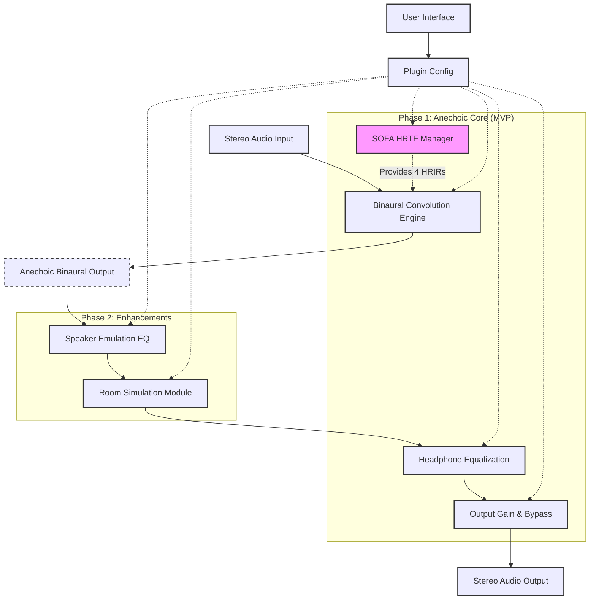

# Open Headstage

Open Headstage is an open-source binaural speaker simulation plugin for headphones, designed for Linux-based audio professionals and enthusiasts.
The goal is to provide a high-quality, flexible tool for experiencing stereo audio as if listening to physical speakers in a well-defined acoustic space.

## Current Phase
Phase 1: Anechoic Core Development (Project Initialization)

## Core Features (MVP - Phase 1)
- Binaural Convolution Engine (4-path for anechoic HRTFs)
- Direct SOFA HRTF/BRIR file loading (`.sofa`)
- Speaker angle selection (manual and presets)
- Headphone Parametric Equalization (10-band PEQ with AutoEq import)
- LV2 and VST3 plugin formats for Linux

## Tech Stack (Planned)
- Language: Rust
- Plugin Framework: `nih-plug`
- SOFA Library: `libmysofa` (via FFI)
- FFT Library: `RustFFT` (or similar)
- Resampling: `rubato` (or similar)

## Bloc Diagram

## Building from Source
(Instructions to be added)

## How to Contribute
(Guidelines to be added)

## Roadmap
(Detailed roadmap to be developed)
