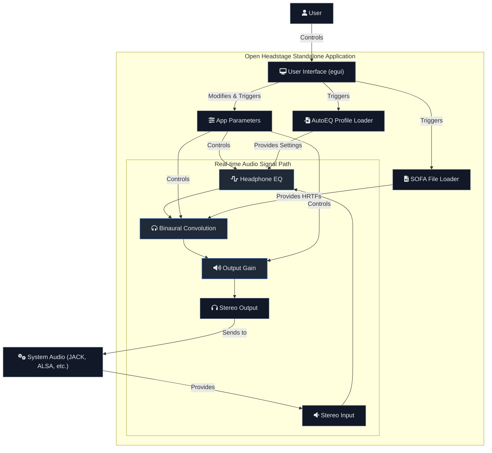

# Open Headstage

<p align="center">
  
</p>

<h3 align="center">A Multiplatform Binaural Speaker Simulator</h3>

<p align="center">
  <strong>Open Headstage is an open-source audio application that recreates the experience of listening to high-end stereo speakers in a room, all within your headphones.</strong>
  <br /><br />
  <a href="https://github.com/your-username/Open-Headstage/releases">Downloads</a>
  ·
  <a href="https://github.com/your-username/Open-Headstage/issues/new?template=bug_report.md">Report Bug</a>
  ·
  <a href="https://github.com/your-username/Open-Headstage/issues/new?template=feature_request.md">Request Feature</a>
</p>

---

## About The Project

Open Headstage is a professional-grade audio processing tool for enthusiasts and professionals who want to achieve a more natural and immersive listening experience on headphones. By using advanced digital signal processing (DSP), it simulates the way sound from stereo speakers interacts with your head and ears, creating a "phantom" soundstage in front of you.

This project is developed as a **standalone application first**, ensuring a stable and feature-rich experience on Linux, Windows, and macOS. The core technology is also planned to be bundled as a **CLAP plugin** for integration into digital audio workstations (DAWs), although this is a secondary goal and full DAW compatibility is still under development.

### Core Features
<div style="font-size: 0.9em;">

*   **Binaural Convolution Engine:** Uses Head-Related Transfer Functions (HRTFs) to accurately position sound in a 3D space.
*   **SOFA File Support:** Load your own HRTF profiles in the standard SOFA format for a personalized experience.
*   **10-Band Parametric EQ:** Correct your headphone's frequency response with a powerful parametric equalizer.
*   **AutoEQ Integration:** Easily import and apply headphone correction profiles from the popular AutoEQ project.
*   **Standalone First:** A dedicated application for Linux, Windows, and macOS with selectable audio backends (JACK, ALSA, etc.).
*   **CLAP Plugin Support (Experimental):** An experimental CLAP plugin is available but is not yet consistently detected or loaded by all DAWs.

</div>

## Signal Path & Architecture

The application's audio processing is designed for high-fidelity and low latency, following a clean and logical signal path within the standalone host.



## Getting Started

### Prerequisites

To build Open Headstage from source, you will need the following tools and libraries.

*   **Rust:** Version 1.87.0 or newer.
*   **System Dependencies:**
    *   **On Linux (Debian/Ubuntu):**
        ```bash
        sudo apt-get update
        sudo apt-get install -y libgl-dev libx11-xcb-dev libmysofa-dev libgtk-3-dev
        ```
    *   **On Linux (Arch/CachyOS):**
        ```bash
        sudo pacman -Syu --needed mesa libx11 libxcb libmysofa gtk3
        ```
    *   **On Windows:** (Instructions pending)
    *   **On macOS:** (Instructions pending)

### Building from Source

1.  **Clone the repository:**
    ```bash
    git clone https://github.com/your-username/Open-Headstage.git
    cd Open-Headstage/app
    ```
2.  **Build the standalone application:**
    ```bash
    cargo build --release
    ```
3.  **Run the application:**
    The compiled executable will be located in the `target/release` directory.
    ```bash
    ./target/release/open-headstage
    ```
4.  **Build the CLAP plugin (Manual & Experimental):**
    The CLAP plugin (`.so` file) must be manually copied into a `.clap` bundle. Note that DAW detection is not guaranteed.
    ```bash
    # First, ensure the library is built
    cargo build --release
    # Create the bundle directory
    mkdir -p ~/.clap/open-headstage.clap
    # Copy the shared library into the bundle
    cp target/release/libopen_headstage.so ~/.clap/open-headstage.clap/open-headstage.so
    ```
    For more details on plugin validation, refer to the "Operational Reminder (Plugin Validation)" in `TODO.md`.

## How to Contribute

Contributions are what make the open source community such an amazing place to learn, inspire, and create. Any contributions you make are **greatly appreciated**.

1.  Fork the Project
2.  Create your Feature Branch (`git checkout -b feature/AmazingFeature`)
3.  Commit your Changes (`git commit -m 'Add some AmazingFeature'`)
4.  Push to the Branch (`git push origin feature/AmazingFeature`)
5.  Open a Pull Request

Please refer to our issue templates for bug reports and feature requests.

## License

Distributed under the Apache License, Version 2.0. See `LICENSE` for more information.

**Note on VST3:** VST3 support is currently disabled. If it were to be re-enabled in the future, the `vst3-sys` crate's GPLv3 license would require any distributed binary containing the VST3 version of this plugin to also have its corresponding source code made available under the GPLv3. Refer to `LICENSES.md` for full details on all project dependencies and their licenses.